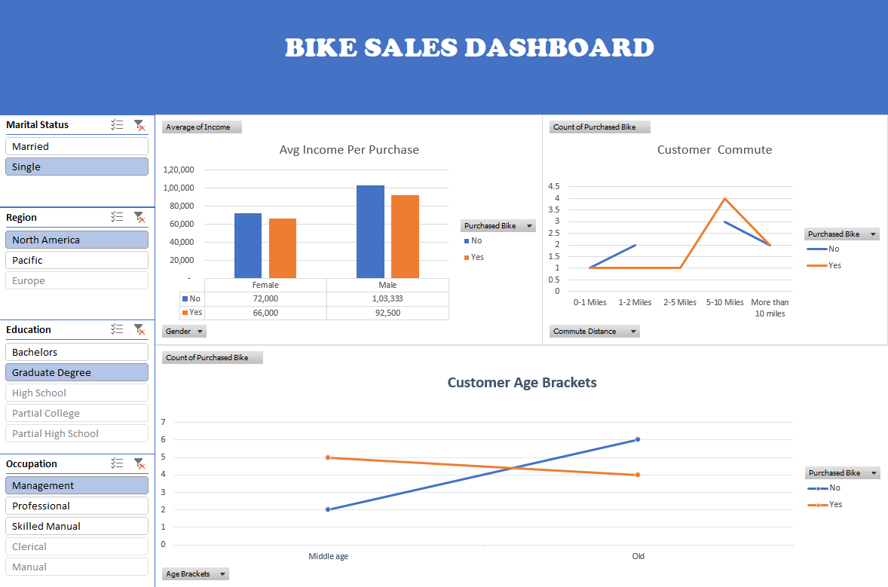

# Bike Sales Dashboard

This project presents an interactive sales dashboard built using the Bike Buyers dataset.
The goal of the analysis is to understand how customer demographics and behavioral factors influence bike purchasing decisions.

## Dashboard Preview

## Data Preparation
- Removed duplicate records to ensure data accuracy
- Standardized categorical values for better readability (e.g., gender and marital status)
- Created age brackets from raw age values:
  - Adolescent: under 31
  - Middle Age: 31–55
  - Old: above 55

## Analysis & Visualizations
Four pivot-based visualizations were created to analyze:
 Average income by gender and purchase status
 Bike purchases across different age brackets
 Customer commute distance vs purchase behavior
 Overall purchase distribution across key demographics

## Dashboard & Interactivity
The visualizations were combined into a single interactive dashboard.
Slicers were added to allow dynamic filtering by:
- Marital Status
- Occupation
- Education
- Region

These filters enable users to explore trends and compare purchasing behavior across different customer segments.

## Key Insights
- Middle-aged customers accounted for a higher number of bike purchases compared to older age groups.
- Customers with higher average income showed a greater likelihood of purchasing a bike.
- Male customers generally have higher average income than female customers, regardless of purchase status.
- Commute distance influences the bike purchase, moderate commute ranges show higher purchase counts.

## Tools Used
- Microsoft Excel
- Pivot Tables
- Charts
- Slicers

